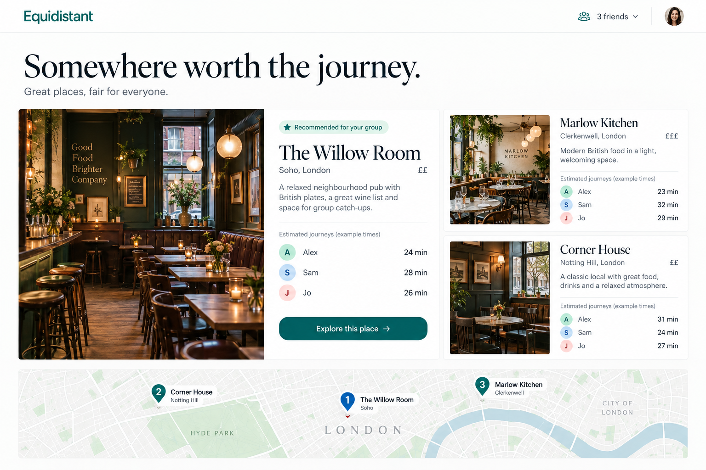
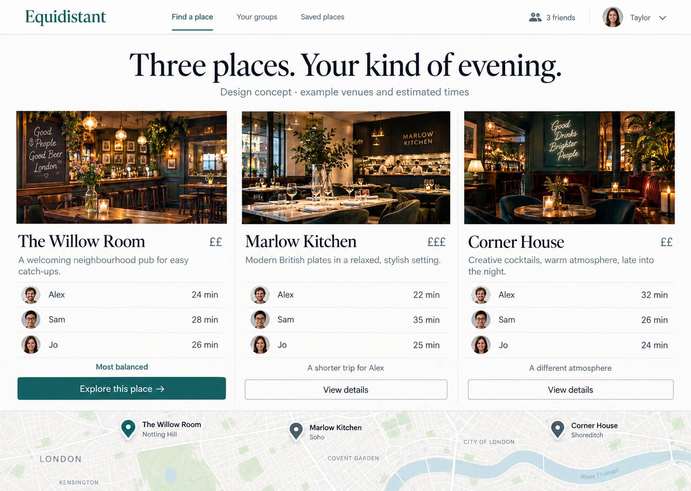
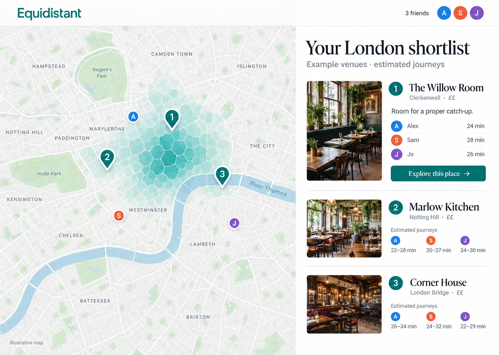

# Venue-results concepts

Prepared 13 September 2026 on `codex/venue-results-concepts`.
These are image mockups for selection, not implemented UI. The public landing
release is independent. No venue redesign is merged or deployed by this branch.

All venue names, photographs, people, locations and journey times shown here
are generated illustrations. They must not be used as real venue facts or live
travel claims. Participant estimates in an implementation must retain their
actual model semantics; station-area times must not silently become verified
door-to-door venue times.

1. **The Good Plan:** one large recommendation with two smaller alternatives.
   Strongest emphasis on atmosphere and a clear first choice.
2. **Three Good Choices:** three equal venue columns with aligned participant
   journeys. Strongest emphasis on direct comparison.
3. **Map and Shortlist:** keep the London map prominent with an expanded
   recommendation and two compact alternatives in a side panel.

The numbering follows image display order in the task. Each image is a separate
concept. Existing branding artwork `frontend/public/og.png` was provided to
image generation as visual reference; the private signed-in workspace was not
accessed. Full prompt constraints: desktop app around 1440x1024, teal branding,
serif editorial headings, light surfaces, 14–16px body type, realistic but
fictional venue imagery, three-person estimates, one primary action.

Google sign-in stays required. Live-route verification, sharing, voting, booking
and account synchronization are deferred. Any incidental navigation such as
"Your groups" or "Saved places" in a generated image is not an approved feature
and should be omitted from implementation. No option has been selected yet.

## 1

## 2

## 3

